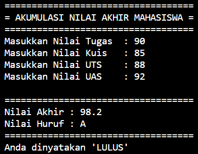
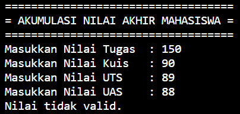
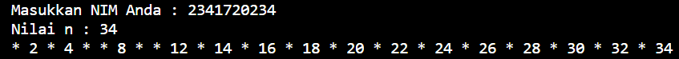
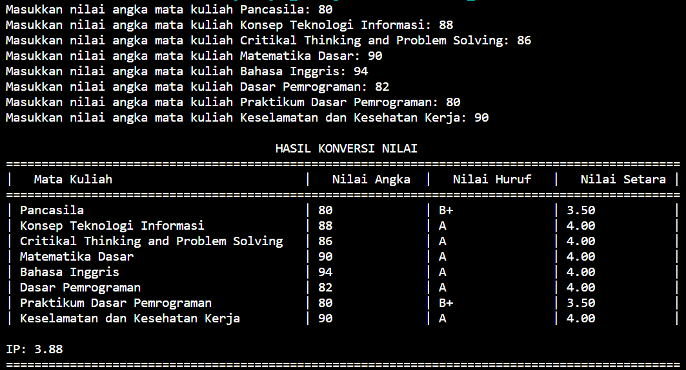
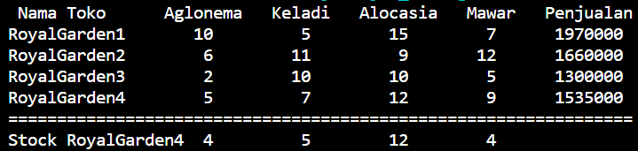
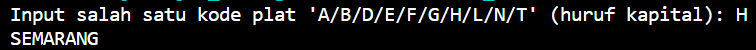
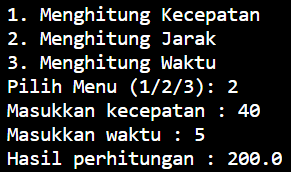

<h2 style="font-family: calibri; text-align: center;"> LAPORAN PRAKTIKUM ALGORITMA DAN STRUKTUR DATA   DASAR PEMROGRAMAN</h2>

 Nama : Anya Callissta Chriswantari   Kelas : 1H   NIM : 2341720234

<i>

     
      
 Gambar 1. Output Pemilihan05.java

     
      
 Gambar 2. Output Pemilihan05.java

     
      
 Gambar 3. Output Perulangan05.java

     
      
 Gambar 4. Output Array05.java

     
      
 Gambar 5. Output Fungsi05.java

     
      
 Gambar 6. Output Tugas105.java

     
      
 Gambar 7. Output Tugas205.java

