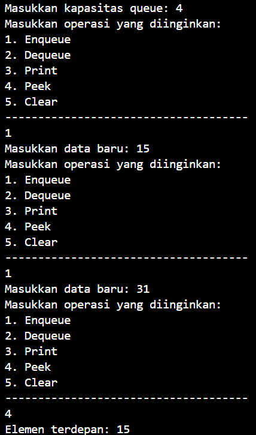
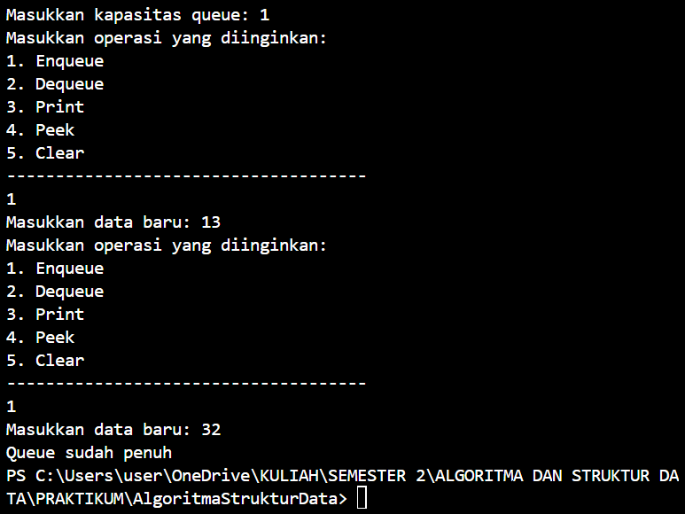
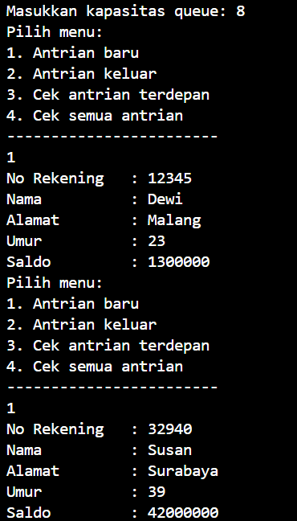
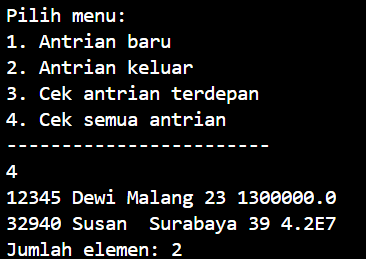
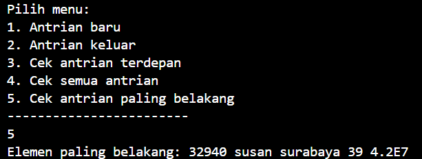
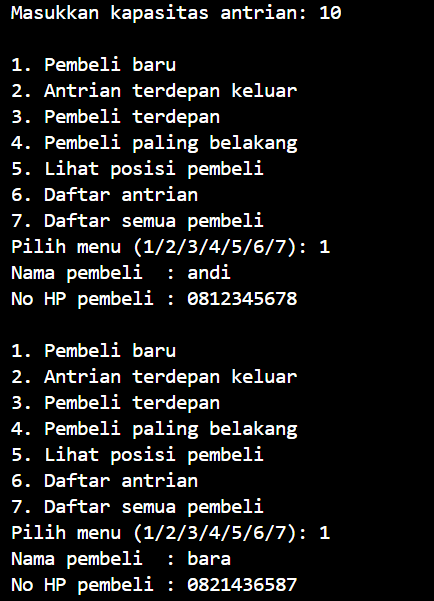

# LAPORAN PRAKTIKUM ALGORITMA DAN STRUKTUR DATA <br> QUEUE  

<p align="center">
 
<p align="center"> Anya Callissta Chriswantari <br>TI IH/05 <br>2341720234


## 10.2 Percobaan 1


_Gambar 1. Output Queue05.java_

### 10.2.3 Pertanyaan Percobaan 1
1. Pada konstruktor, mengapa nilai awal atribut front dan rear bernilai -1, sementara atribut size bernilai 0?
    * Karena nilai -1 pada front dan rear menandakan posisi queue masih kosong yang berarti tidak ada elemen di depan front atau di belakang rear, sedangkan size bernilai 0 menandakan jumlah awal elemen yang masih kosong
2. Pada method Enqueue, jelaskan maksud dan kegunaan dari potongan kode berikut!
``` java
if (rear == max - 1) {
    rear = 0;
}
```
    * Jika rear mencapai batas maksimum antrian (max - 1), kode rear = 0 akan dijalankan, rear akan kembali ke indeks 0, sehingga elemen baru dapat ditambahkan di awal antrian jika ada ruang kosong
3. Pada method Dequeue, jelaskan maksud dan kegunaan dari potongan kode berikut!
``` java
if (front == max - 1) {
    front = 0;
}
```
    * Jika front mencapai batas maksimum (max - 1), kode front  = 0 akan dijalankan, front kembali ke indeks 0 dan elemen dapat dihapus dengan benar
4. Pada method print, mengapa pada proses perulangan variabel i tidak dimulai dari 0 (int i=0), melainkan int i=front?
    * Karena saat dilakukan input data, data tersebut akan berada di indeks front, sehingga data dimulai dari front
5. Perhatikan kembali method print, jelaskan maksud dari potongan kode berikut!
``` java
i = (i + 1) % max;
```
    * Kode (i + 1) digunakan untuk meningkatkan nilai i ke indeks berikutnya dalam array yang menyimpan elemen antrian, operasi modulus % max digunakan untuk memastikan bahwa nilai i tetap berada dalam panjang maksimum antrian,hasil dari operasi (i + 1) % max kemudian ditetapkan kembali ke variabel i, dengan ini iterasi akan berlanjut ke indeks berikutnya dalam circular queue atau kembali ke awal antrian jika telah mencapai akhir array
6. Tunjukkan potongan kode program yang merupakan queue overflow!
    * ``` java
        if (isFull()) {
        System.out.println("Queue sudah penuh");
        }
        ```
7. Pada saat terjadi queue overflow dan queue underflow, program tersebut tetap dapat berjalandan hanya menampilkan teks informasi. Lakukan modifikasi program sehingga pada saat terjadi queue overflow dan queue underflow, program dihentikan!
    * 

    _Gambar 1.1 Output Queue05.java_

## 10.3 Percobaan 2



_Gambar 2. Output Nasabah05.java_

### 10.3.3 Pertanyaan Percobaan 2
1. Pada class QueueMain, jelaskan fungsi IF pada potongan kode program berikut!
```java
if (!"".equals(data.norek) && !"".equals(data.nama) && !"".equals(data.alamat) && data.umur != 0 && data.saldo != 0) {
    System.out.println("Antrian yang keluar: " + data.norek + " " + data.nama + " " + data.alamat + " " + data.umur + " " + data.saldo);
    break;
    }
```
    * if berfungsi untuk mengecek kondisi jika kondisi norek, nama, dan alamat tidak sama dengan kosong serta kondisi umur dan saldo tidak sama dengan 0, akan dijalankan statemen selanjutnya
2. Lakukan modifikasi program dengan menambahkan method baru bernama peekRear pada class Queue yang digunakan untuk mengecek antrian yang berada di posisi belakang! Tambahkan pula daftar menu 5. Cek Antrian paling belakang pada class QueueMain sehingga method peekRear dapat dipanggil!
    * 

        _Gambar 2. Output Nasabah05.java_

## 10.4 Tugas
Buatlah program antrian untuk mengilustasikan pesanan disebuah warung. Ketika seorang  pembeli akan mengantri, maka dia harus mendaftarkan nama dan nomor HP. Dengan method :
• Method create(), isEmpty(), isFull(), enqueue(), dequeue() dan print(), kegunaannya sama seperti yang telah dibuat pada Praktikum
• Method peek(): digunakan untuk menampilkan data Pembeli yang berada di posisi antrian paling depan
• Method peekRear(): digunakan untuk menampilkan data Pembeli yang berada di posisi antrian paling belakang
• Method peekPosition(): digunakan untuk menampilkan seorang pembeli (berdasarkan nama) posisi antrian ke berapa
• Method daftarPembeli(): digunakan untuk menampilkan data seluruh pembeli 

 
_p10.png) 
_p10.png) 
_p10.png)

_Gambar 3. Output Pembeli.java_
