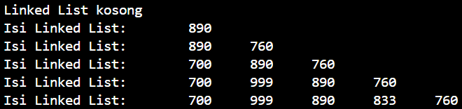
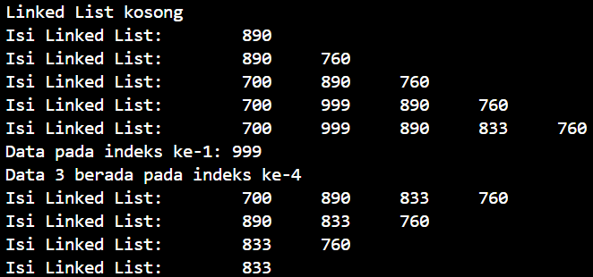
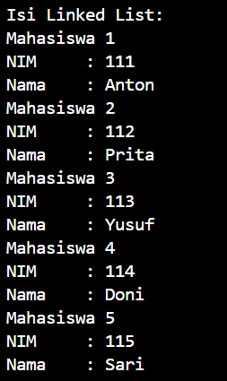
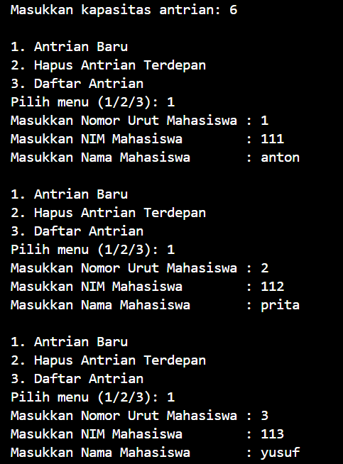

# LAPORAN PRAKTIKUM ALGORITMA DAN STRUKTUR DATA <br> LINKED LIST  

<p align="center">
 
<p align="center"> Anya Callissta Chriswantari <br>TI IH/05 <br>2341720234


## 11.2 Percobaan 1


_Gambar 1. Output SLLMain.java_

### 11.2.3 Pertanyaan Percobaan 1
1. Mengapa hasil compile kode program di baris pertama menghasilkan “Linked List Kosong”?
    * Karena pada eksekusi method print pertama, belum dilakukan input data, sehingga kondisi linked list masih kosong dan memunculkan statement tersebut
2. Jelaskan kegunaan variable tmp secara umum pada setiap method!
    * Variable tmp digunakan sebagai variabel sementara untuk mengakses indeks yang dibutuhkan untuk melakukan operasi yang sedang dieksekusi
3. Perhatikan class SingleLinkedList, pada method insertAt Jelaskan kegunaan kode berikut 
``` java
if (temp.next.next == null) {
    tail = temp.next;
}
```
    * temp.next.next == null untuk mengecek apakah node yang berada setelah node yang ditunjuk oleh temp bernilai null, jika ya, temp.next adalah node terakhir dalam linked list. Kode tersebut berguna untuk memperbarui tail ke node terakhir dalam linked list setelah penambahan elemen baru pada method insertAt

## 11.3 Percobaan 2


_Gambar 2. Output SLLMain.java_

### 11.3.3 Pertanyaan Percobaan 2
1. Mengapa digunakan keyword break pada fungsi remove? Jelaskan!
    * Karena break berfungsi untuk menghentikan eksekusi setelah operasi penghapusan yang diperlukan telah dilakukan, jika tidak digunakan break, maka akan mengakibatkan terjadi iterasi yang tidak diperlukan
2. Jelaskan kegunaan kode dibawah pada method remove
``` java
else if (temp.next.data == key) {
    temp.next = temp.next.next;
```
    * Kode di atas memastikan bahwa node yang ditemukan dengan nilai data yang sesuai dengan kunci akan dihapus dari linked list dengan melompati node yang ingin dihapus (temp.next) sehingga node tersebut diabaikan dalam struktur linked list

## 11.4 Tugas
1. Implementasikan Linked List untuk mahasiswa. Gunakan 4 macam penambahan data yang telah dipelajari sebelumnya untuk menginputkan data.



_Gambar 3. Output Mahasiswa.java_

2. Buatlah implementasi program antrian layanan unit kemahasiswaan sesuai dengan kondisi yang ditunjukkan pada soal nomor 1! Ketentuan
a. Implementasi antrian menggunakan Queue berbasis Linked List!
b. Program merupakan proyek baru, bukan modifikasi dari soal nomor 1!

__p12.png)
__p12.png)
__p12.png)

_Gambar 4. Output UnitKemahasiswaan.java_