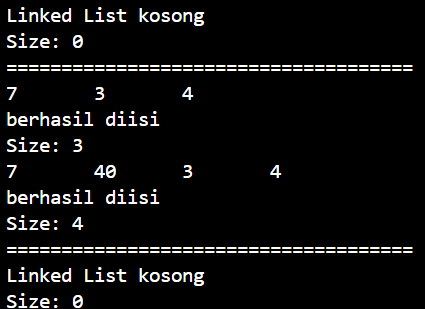
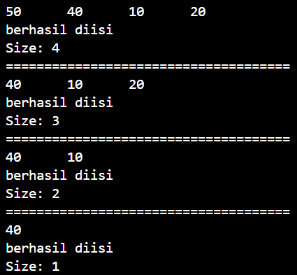
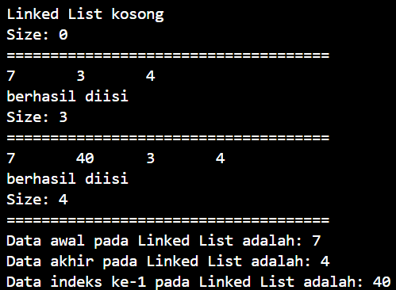
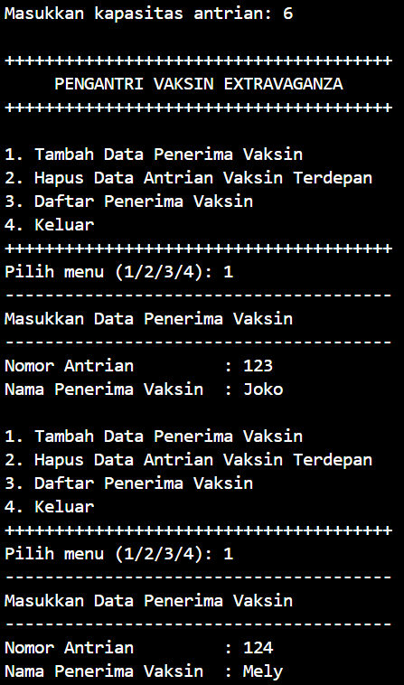
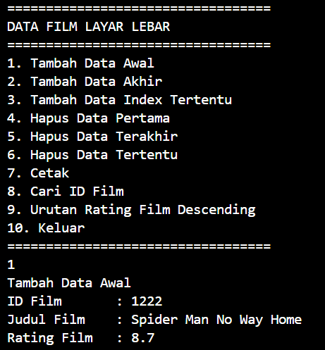

# LAPORAN PRAKTIKUM ALGORITMA DAN STRUKTUR DATA <br> DOUBLE LINKED LIST  

<p align="center">
 
<p align="center"> Anya Callissta Chriswantari <br>TI IH/05 <br>2341720234


## 12.2 Percobaan 1


_Gambar 1. Output DoubleLinkedListMain.java_

### 12.2.3 Pertanyaan Percobaan 1
1. Jelaskan perbedaan antara single linked list dengan double linked lists!
    * Single linked list hanya bisa menambahkan data di belakang karena tidak memiliki node previous dan memerlukan sedikit memori, sedangkan double linked list bisa menambahkan data sebelum dan setelah data yang ada karena memiliki node previous dan next serta memerlukan lebih banyak urung
2. Perhatikan class Node, di dalamnya terdapat atribut next dan prev. Untuk apakah atribut tersebut?
    * Next untuk menyimpan pointer ke node berikutnya sedangkan prev untuk menyimpan pointer ke node sebelumnya
3. Perhatikan konstruktor pada class DoubleLinkedLists. Apa kegunaan inisialisasi atribut head dan size seperti pada gambar berikut ini?
``` java
public DoubleLinkedList() {
    head = null;
    size = 0;
}
```
    * Inisialisasi head dengan nilai null menandakan bahwa linked list saat pertama kali dibuat tidak memiliki elemen apa pun, yaitu, linked list tersebut kosong. Sedangkan size digunakan untuk menyimpan jumlah elemen dalam linked list, inisialisasi size = 0 menandakan bahwa kondisi awal masih kosong.
4. Pada method addFirst(), kenapa dalam pembuatan object dari konstruktor class Node prev dianggap sama dengan null?
``` java
Node newNode = new Node(null, item, head);
```
    * Karena kondisi linked list masih kosong sehingga nilai prev masih 0 karena tidak ada data sebelumnya
5. Perhatikan pada method addFirst(). Apakah arti statement head.prev = newNode ?
    * head.prev = newNode digunakan untuk memastikan bahwa node yang saat ini menjadi head memiliki referensi yang benar ke node baru sebagai node sebelumnya
6. Perhatikan isi method addLast(), apa arti dari pembuatan object Node dengan mengisikan parameter prev dengan current, dan next dengan null?
``` java
Node newNode = new Node(current, item, null);
```
    * Pembuatan object Node dengan parameter prev diisi dengan current dan next dengan null dalam method addLast() bertujuan untuk menambahkan node baru di akhir linked list, dengan node baru ini terhubung sebagai pointer dari node terakhir yang ada saat ini, dan memastikan node baru menjadi node terakhir (tail) dari linked list.
7. Pada method add(), terdapat potongan kode program sebagai berikut, jelaskan maksudnya!
``` java
if (current.prev == null) {
    Node newNode = new Node(null, item, current);
    current.prev = newNode;
    head = newNode;
} 
```
    * if (current.prev == null) untuk menentukan apakah current adalah head dari linked list, jika prev dari current adalah null, berarti current adalah node pertama dalam linked list. Node newNode = new Node(null, item, current); untuk embuat node baru newNode dengan prev diinisialisasi ke null, item sebagai data, dan next menunjuk ke current. current.prev = newNode; untuk memperbarui referensi prev dari current untuk menendakan bahwa sekarang ada node baru di depannya. head = newNode; untuk mengatur newNode sebagai node pertama (head) dari linked list, karena node ini sekarang berada di depan current.

## 12.3 Percobaan 2


_Gambar 2. Output DoubleLinkedListMain.java_

### 12.3.3 Pertanyaan Percobaan 2
1. Apakah maksud statement berikut pada method removeFirst()?
``` java
head = head.next;
head.prev = null;
```
    * head = head.next; untuk menunjukkan jika head saat ini dihapus, nilai head akan merujuk ke node setelahnya. head.prev = null; untuk menandakan bahwa nilai dari prev sebelum head terbaru bernilai null karena head lama telah dihapus.
2. Bagaimana cara mendeteksi posisi data ada pada bagian akhir pada method removeLast()?
    * Method removeLast() mendeteksi posisi data di bagian akhir linked list dengan menggunakan loop untuk mencari node kedua terakhir (current.next.next == null). Setelah node kedua terakhir ditemukan, method ini menghapus node terakhir dengan memutuskan referensi next dari node kedua terakhir ke node terakhir, sehingga node terakhir dihapus dari linked list.
3. Jelaskan alasan potongan kode program di bawah ini tidak cocok untuk perintah remove
``` java
Node tmp = head.next;
head.next = tmp.next;
tmp.next.prev = head;
```
    * Tidak menghapus node pertama dengan benar karena kode ini tidak mengubah head ke node berikutnya, hanya mengubah referensi head.next. tidak menghapus node terakhir dengan benar karena Jika node yang ingin dihapus adalah node terakhir, maka tmp.next akan null, dan mencoba mengakses tmp.next.prev akan menyebabkan NullPointerException, dan tidak menghapus node tengah dengan benar karena hanya ditujukan untuk menghapus node setelah head (yaitu, node kedua). Namun, ini hanya benar jika head bukan node terakhir dan jika head.next tidak null.
4. Jelaskan fungsi kode program berikut ini pada fungsi remove! 
``` java
current.prev.next = current.next;
current.next.prev = current.prev;
```
    * current.prev.next = current.next; untuk mMemutuskan hubungan dari node sebelumnya (current.prev) ke node yang ingin dihapus (current) dengan mengatur next dari node sebelumnya untuk menunjuk ke node yang berada setelah node yang ingin dihapus (current.next). current.next.prev = current.prev; untuk memutuskan hubungan dari node yang berada setelah node yang ingin dihapus (current.next) ke node yang ingin dihapus (current) dengan mengatur prev dari node yang berada setelah current untuk menunjuk ke node sebelumnya dari current (current.prev).

## 12.4 Percobaan 3


_Gambar 3. Output DoubleLinkedListMain.java_

### 12.4.3 Pertanyaan Percobaan 3
1. Jelaskan method size() pada class DoubleLinkedLists!
    * Method size() pada class DoubleLinkedLists berfungsi untuk mengembalikan jumlah node dalam linked list.
2. Jelaskan cara mengatur indeks pada double linked list supaya dapat dimulai dari indeks ke-1!
    * Dengan mengubah inisialisasi index dan i yang awalnya 0 menjadi 1 dan mengubah kondisi pada if menjadi index < 1 || index > size
3. Jelaskan perbedaan karakteristik fungsi Add pada Double Linked Lists dan Single Linked Lists! 
    * Pada DLL memiliki pointer yang menunjuk ke nodesebelum dan sesudah, sedangkan SLL hanya memiliki pointer yang merujuk ke node sebelumnya
4. Jelaskan perbedaan logika dari kedua kode program di bawah ini!
``` java
public boolean isEmpty() {
    if (size == 0) {
        return true;
    } else {
        return false;
    }
}
```
``` java
public boolean isEmpty() {
    return head == null;
}
```
    * Kode program pertama menggunakan variabel size untuk menentukan apakah linked list kosong. Ini diasumsikan bahwa size selalu terjaga dan sesuai dengan jumlah elemen yang sebenarnya dalam linked list. Kode program kedua hanya memeriksa keberadaan head. Jika head tidak ada, berarti linked list kosong. Pendekatan ini lebih langsung dan sederhana, terutama jika linked list hanya memiliki satu elemen, di mana size tidak terlalu relevan.

## 12.5 Tugas
1. Buat program antrian vaksinasi menggunakan queue berbasis double linked list sesuai ilustrasi (counter jumlah antrian tersisa di menu cetak(3) dan data orang yang telah divaksinasi di menu Hapus Data(2) harus ada)
 
_p13.png) 
_p13.png) 
_p13.png) 
_p13.png)

_Gambar 4. Output Vaksinasi.java_
2. Buatlah program daftar film yang terdiri dari id, judul dan rating menggunakan double linked lists, bentuk program memiliki fitur pencarian melalui ID Film dan pengurutan Rating secara descending. Class Film wajib diimplementasikan dalam soal ini
 
_p13.png) 
_p13.png) 
_p13.png) 
_p13.png)
_p13.png) 
_p13.png) 
_p13.png) 
_p13.png) 
_p13.png)
_p13.png)

_Gambar 5. Output Film.java_
