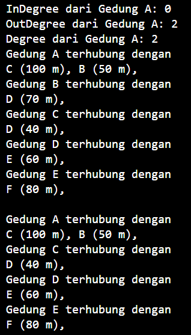
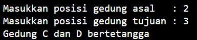
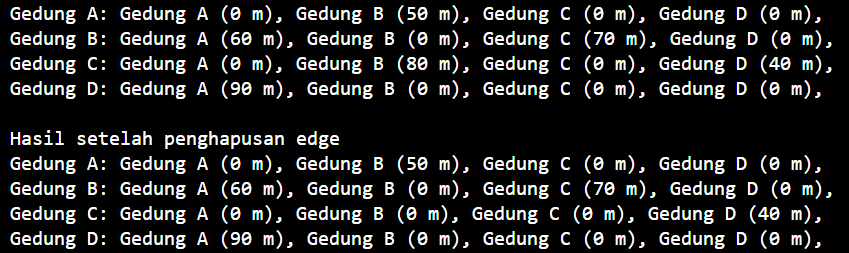
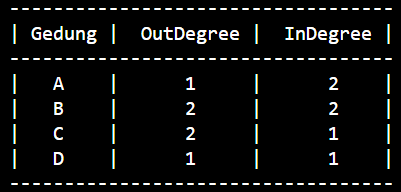
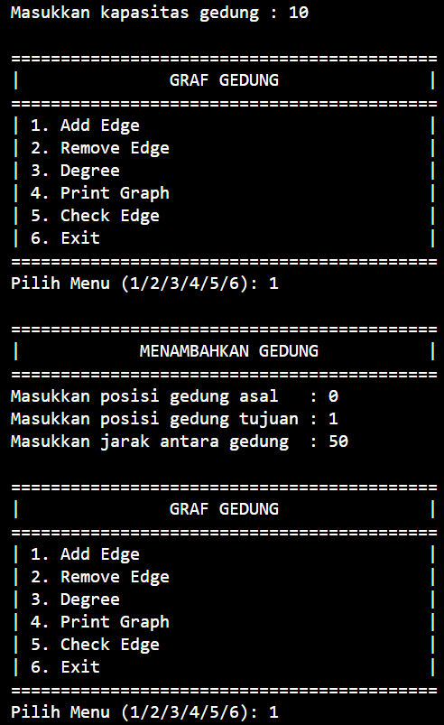
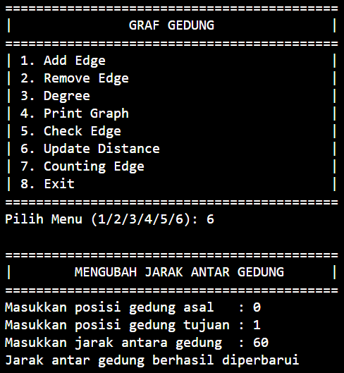
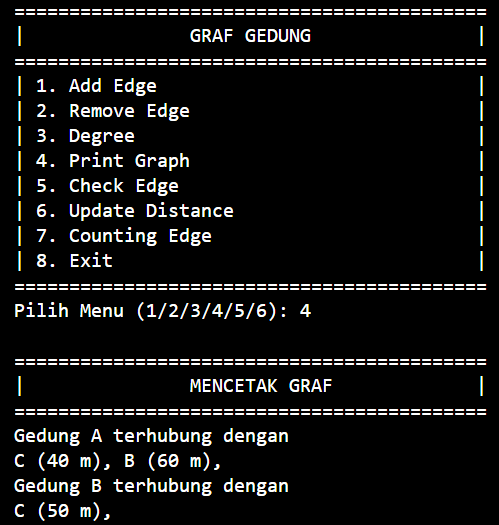

# LAPORAN PRAKTIKUM ALGORITMA DAN STRUKTUR DATA <br> GRAPH  

<p align="center">
 
<p align="center"> Anya Callissta Chriswantari <br>TI IH/05 <br>2341720234


## 12.2 Percobaan 1


_Gambar 1. Output GraphMain05.java_

### 12.2.3 Pertanyaan Percobaan 1
1. Perbaiki kode program Anda apabila terdapat error atau hasil kompilasi kode tidak sesuai!
2. Pada class Graph, terdapat atribut list[] bertipe DoubleLinkedList. Sebutkan tujuan pembuatan variabel tersebut!
    * a. variabel list[] digunakan untuk merepresentasikan graf sebagai kumpulan adjacency list (cara yang efisien untuk menyimpan graf karena hanya menyimpan simpul yang benar-benar memiliki edge)
    <br>b. menggunakan DoubleLinkedList05 mempermudah penambahan, penghapusan, dan pencarian edge antara dua vertex
    <br>c. dengan adjacency list, operasi-operasi seperti iterasi melalui tetangga-tetangga suatu simpul, menghitung derajat simpul, dan lainnya bisa dilakukan dengan lebih mudah dan cepat
3. Jelaskan alur kerja dari method removeEdge!
    * a. method menerima parameter asal dan tujuan
    <br>b.dilakukan looping untuk mengiterasi semua vertex
    <br>c.dilakukan pengecekan apakah index saat ini (i) sama dengan tujuan, jika ya maka metode remove pada DoubleLinkedList05 dipanggil untuk menghapus edge dari asal ke tujuan dengan cara menghapus node yang memiliki nilai tujuan dari adjacency list asal
4. Apakah alasan pemanggilan method addFirst() untuk menambahkan data, bukan method add jenis lain saat digunakan pada method addEdge pada class Graph?
    * Dalam  adjacency list, urutan penambahan edge tidak terlalu penting sehingga method addfisrt sangat sederhana untuk diimplementasikan dan digunakan. Dengan menambahkan di awal, semua elemen baru berada di posisi yang mudah diakses segera setelah penambahan
5. Modifikasi kode program sehingga dapat dilakukan pengecekan apakah terdapat jalur antara suatu node dengan node lainnya (Anda dapat memanfaatkan Scanner)

_per1_p15.2.png)

_Gambar 1.1, Output GraphMain05.java_

## 12.3 Percobaan 2


_Gambar 2. Output GraphMain05.java_

### 12.3.3 Pertanyaan Percobaan 2
1. Perbaiki kode program Anda apabila terdapat error atau hasil kompilasi kode tidak sesuai!
2. Apa jenis graph yang digunakan pada Percobaan 2?
    * Percobaan 2 menggunakan directed weighted graph menggunakan adjacency matrix. Setiap edge dalam graf memiliki arah dan bobot yang tersimpan dalam elemen-elemen matriks
3. Apa maksud dari dua baris kode berikut?
```java
gdg.makeEdge(1, 2, 70);
gdg.makeEdge(2, 1, 80);
``` 
* Dua baris kode tersebut menambahkan dua edge dengan arah yang berlawanan dan bobot yang berbeda ke dalam directed weighted graph yang diimplementasikan menggunakan adjacency matrix. Hal ini menunjukkan bahwa graf dapat memiliki edge dua arah dengan bobot yang berbeda untuk setiap arah.
4. Modifikasi kode program sehingga terdapat method untuk menghitung degree, termasuk inDegree dan outDegree!


_Gambar 2.1. Output GraphMain05.java_

### 12.4.3 Latihan Praktikum
1. Modifikasi kode program pada class GraphMain sehingga terdapat menu program yang bersifatdinamis, setidaknya terdiri dari:
    <br>a. Add Edge 
    <br>b. Remove Edge 
    <br>c. Degree 
    <br>d. Print Graph 
    <br>e. Cek Edge
<br>Pengguna dapat memilih menu program melalui input Scanner
 
_p15.2.png) 
_p15.2.png) 
_p15.2.png) 
_p15.2.png) 
_p15.2.png) 
_p15.2.png) 
_p15.2.png) 
_p15.2.png)

_Gambar 3.1 Output GraphMain.java_ 

2. Tambahkan method updateJarak pada Percobaan 1 yang digunakan untuk mengubah jarak antara dua node asal dan tujuan!
 

_Gambar 3.2 Output GraphMain.java_

3. Tambahkan method hitungEdge untuk menghitung banyaknya edge yang terdapat di dalam graf!
 
_p15.2.png)

_Gambar 3.3 Output GraphMain.java_