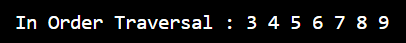
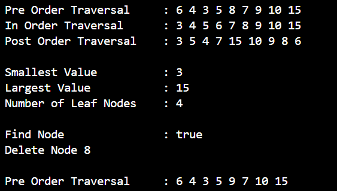

# LAPORAN PRAKTIKUM ALGORITMA DAN STRUKTUR DATA <br> TREE  

<p align="center">
 
<p align="center"> Anya Callissta Chriswantari <br>TI IH/05 <br>2341720234


## 13.2 Percobaan 1


_Gambar 1. Output BinaryTreeMain.java_

### 13.2.3 Pertanyaan Percobaan 1
1. Mengapa dalam binary search tree proses pencarian data bisa lebih efektif dilakukan dibanding binary tree biasa?
    * Karena dalam binary search tree memiliki aturan subtree kiri lebih kecil dari subtree kanan, sehingga hal ini akan memperkecil ruang pencarian
2. Untuk apakah di class Node, kegunaan dari atribut left dan right?
    * Atribut left dan right digunakan untuk merujuk ke node left child dan right child
3. a. Untuk apakah kegunaan dari atribut root di dalam class BinaryTree?
    * Untuk merujuk ke node akar/induk/paling atas dalam tree, sebagai titik masuk operasi pada tree, dan memeriksa kondisi tree jika root bernilai null maka tree masih kosong

    <br>b. Ketika objek tree pertama kali dibuat, apakah nilai dari root?
    * Nilai root bernilai null yang menandakan bahwa tree masih kosong
4. Ketika tree masih kosong, dan akan ditambahkan sebuah node baru, proses apa yang akan terjadi?
    * Jika tree masih kosong, kode root = new Node05(data) pada if (isEmpty()) akan dieksekusi , pada kode tersebut nilai root akan di isi dengan nilai data yang diberikan
5. Perhatikan method add(), di dalamnya terdapat baris program seperti di bawah ini. Jelaskan secara detil untuk apa baris program tersebut?
``` java
if (data < current.data) {
    if (current.left != null) {
        current = current.left;
    } else {
        current.left = new Node05(data);
        break;
    }
}
```
    * Pada kode tersebut dilakukan pengecekan utama (if (data < current.data)) apakah nilai dari data lebih kecil dari current (node saat ini). Jika iya maka akan dilakukan pengecekan lain (if (current.left != null)) apakah left child dari current tidak kosong, jika iya maka nilai current akan menggantikan nilai yang ada pada left child. Namun, jika left child dari current kosong (else), current akan ditambahkan di left child pada current

## 13.3 Percobaan 2


_Gambar 2. Output BinaryTreeArrayMain.java_

### 13.3.3 Pertanyaan Percobaan 2
1. Apakah kegunaan dari atribut data dan idxLast yang ada di class BinaryTreeArray?
    * Atribut data digunakan untuk menyimpan nilai-nilai yang akan ditambahkan, sedangkan idxLast digunakan untuk menyimpan index terakhir serta berguna untuk menentukan batas, ukuran, dan  posisi terakhir dari array
2. Apakah kegunaan dari method populateData()?
    * Method populateData() digunakan ketika akan mengisi tree dengan satu langkah menggunakan sekumpulan data yang sudah ada, dengan cara menginisialisasi array dan data yang diberikan
3. Apakah kegunaan dari method traverseInOrder()?
    * Untuk mencetak data dengan cara melakukan traversal secara berurutan dari node paling kiri, node root, dan terakhir node paling kanan
4. Jika suatu node binary tree disimpan dalam array indeks 2, maka di indeks berapakah posisi left child dan rigth child masing-masing?
    * Dalam binary tree array, indeks left child dan right child dapat dihitung menggunakan rumus left child = 2 * node + 1 dan right child = 2 * node + 2. Berdasarkan rumus tersebut didapatkan indeks left child = 2 * 2 + 1 = 5 dan indeks right child = 2 * 2 + 2 = 6
5. Apa kegunaan statement int idxLast = 6 pada praktikum 2 percobaan nomor 4?
    * Statement tersebut digunakan untuk membatasi eksekusi yang dilakukan, program akan mengeksekusi array hanya smampai indeks 6

13.4 Tugas Praktikum
1. Buat method di dalam class BinaryTree yang akan menambahkan node dengan cara rekursif.
2. Buat method di dalam class BinaryTree untuk menampilkan nilai paling kecil dan yang paling besar yang ada di dalam tree.
3. Buat method di dalam class BinaryTree untuk menampilkan data yang ada di leaf.
4. Buat method di dalam class BinaryTree untuk menampilkan berapa jumlah leaf yang ada di dalam tree.


_Gambar 3. Output BinaryTreeMain.java (tugas no 1-4)_

5. Modifikasi class BinaryTreeArray, dan tambahkan :
• method add(int data) untuk memasukkan data ke dalam tree
• method traversePreOrder() dan traversePostOrder()


_Gambar 4. Output BinaryTreeArrayMain.java