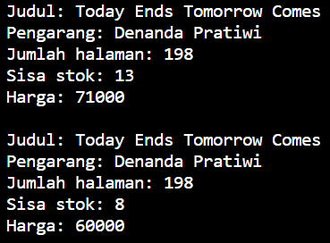
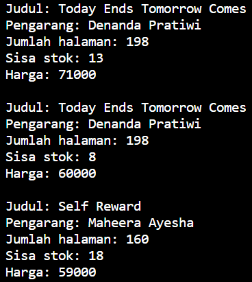
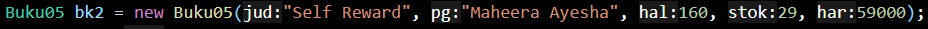
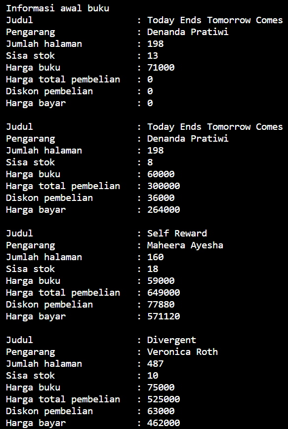
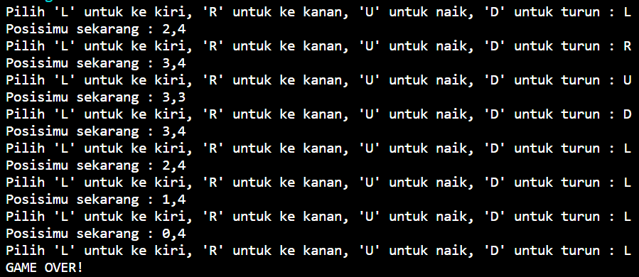

# LAPORAN PRAKTIKUM ALGORITMA DAN STRUKTUR DATA <br> DASAR PEMROGRAMAN

## 2.1 Percobaan 1


_Gambar 1. Percobaan 1_

### 2.1.3 Pertanyaan
1. Sebutkan dua karakteristik class atau object!
    * Karakteristik objek yaitu mempunyai sesuatu (data, atribut, variabel) dan melakukan sesuatu (fungsi, method)
2. Perhatikan class Buku pada Praktikum 1 tersebut, ada berapa atribut yang dimiliki oleh class Buku? Sebutkan apa saja atributnya!
    * Terdapat 5 atribut, yaitu: judul, pengarang, halaman, stok, dan harga.
3. Ada berapa method yang dimiliki oleh class tersebut? Sebutkan apa saja methodnya!
    * Terdapat 4 method, yaitu: tampilInformasi(), terjual(int jml), restock(int jml), dan gantiHarga(int hrg).
4. Perhatikan method terjual() yang terdapat di dalam class Buku. Modifikasi isi method tersebut sehingga proses pengurangan hanya dapat dilakukan jika stok masih ada (lebih besar dari 0)!
    *   ```java
        void terjual(int jml) {
        if (stok > 0) {
            stok -= jml;
        }
        }
        ```
5. Menurut Anda, mengapa method restock() mempunyai satu parameter berupa bilangan int?
    * Karena parameter tersebut digunakan untuk menghitung restock

## 2.2 Percobaan 2


_Gambar 2. Percobaan 2_

### 2.2.3 Pertanyaan
1. Pada class BukuMain, tunjukkan baris kode program yang digunakan untuk proses instansiasi!
    * ```java
        Buku05 bk1 = new Buku05();
        ```
2. Apa nama object yang dihasilkan?
    * bk1
3. Bagaimana cara mengakses atribut dan method dari suatu objek?
    * Dengan cara menuliskan objek.atribut/method, contohnya
         ```java
        bk1.judul = "Today Ends Tomorrow Comes";
        bk1.pengarang = "Denanda Pratiwi";
        bk1.halaman = 198;
        bk1.stok = 13;
        bk1.harga = 71000;

        bk1.tampilInformasi();
        bk1.terjual(5);
        bk1.gantiHarga(60000);
        bk1.tampilInformasi();
        ```
4. Mengapa hasil output pemanggilan method tampilInformasi() pertama dan kedua berbeda?
    * Karena pada method tampilInformasi() kedua merupakan hasil setelah eksekusi method diatasnya

## 2.3 Percobaan 3


_Gambar 3. Percobaan 3_

### 2.3.3 Pertanyaan
1. Pada class Buku di Percobaan 3, tunjukkan baris kode program yang digunakan untuk mendeklarasikan konstruktor berparameter!
    * ```java
        public Buku05(String jud, String pg, int hal, int stok, int har) {
        judul = jud;
        pengarang = pg;
        halaman = hal;
        this.stok = stok;
        harga = har;
        }
        ```
2. Perhatikan class BukuMain. Apa sebenarnya yang dilakukan pada baris program berikut? 

    * Baris tersebut berfungsi sebagai instansiasi objek
3. Hapus konstruktor default pada class Buku, kemudian compile dan run program. Bagaimana hasilnya? Jelaskan mengapa hasilnya demikian!
    * 

    _Gambar 3.1. Jawaban Soal No.3_

     Jika suatu constructor tidak didefinisikan dengan benar dalam suatu class, akan muncul pesan tersebut saat saat mencoba membuat objek dari class.
4. Setelah melakukan instansiasi object, apakah method di dalam class Buku harus diakses secara berurutan? Jelaskan alasannya!
    * Pengeksekusian method tidak harus secara berurutan, karena method dibuat untuk menyelesaikan tugas-tugas yang ekssekusinya dilakukan secara terpisah, sehingga pengaksesan dapat dilakukan sesuai kebutuhan.
5. Buat object baru dengan nama buku<NamaMahasiswa> menggunakan konstruktor berparameter dari class Buku!
    * ```java
        Buku05 bukuAnyaCallissta = new Buku05("Divergent", "Veronica Roth", 487, 17, 75000);
        bukuAnyaCallissta.tampilInformasi();
        ```
## 2.4 Latihan Praktikum


_Gambar 4. Tugas 1_



_Gambar 5. Tugas 2_