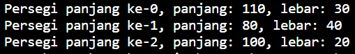
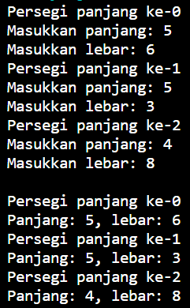
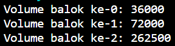
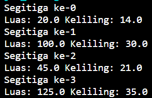
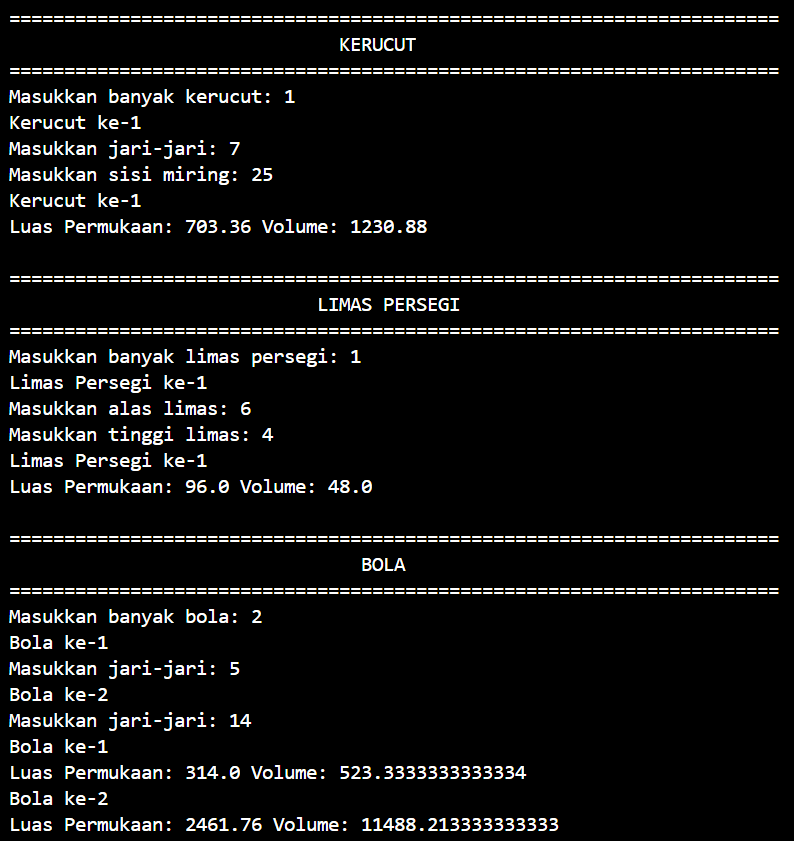
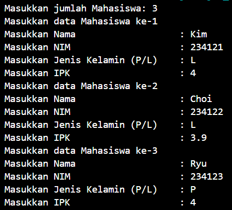

# LAPORAN PRAKTIKUM ALGORITMA DAN STRUKTUR DATA <br> ARRAY OF OBJECT

## 3.2 Percobaan 1


_Gambar 1. Output ArrayObject05.java_

### 3.2.3 Pertanyaan Percobaan 1
1. Berdasarkan uji coba 3.2, apakah class yang akan dibuat array of object harus selalu memiliki atribut dan sekaligus method?Jelaskan!
    * Class tidak harus memiliki atribut dan method sekaligus, setiap class bisa hanya memiliki atribut saja jika class berfungsi untuk menyimpan data atau hanya method saja jika class berfungsi untuk melakukan tugas. 
2. Apakah class PersegiPanjang memiliki konstruktor?Jika tidak, kenapa dilakukan pemanggilan konstruktur pada baris program berikut :
    ```java 
    ppArray[i] = new PersegiPanjang();
    ```
    * Tidak, pemanggilan baris program tersebut digunakan untuk instansiasi.
3. Apa yang dimaksud dengan kode berikut ini:
    ```java
    PersegiPanjang[] ppArray = new PersegiPanjang[3];
    ```
    * Kode tersebut berfungsi untuk melakukan inisialisasi jumlah indeks object array, maksud kode tersebut adalah object ppArray pada class PersegiPanjang memiliki indeks/elemen sebanyak 3.
4. Apa yang dimaksud dengan kode berikut ini:
    ```java
    ppArray[1] = new PersegiPanjang();
    ppArray[1].panjang = 80;
    ppArray[1].lebar = 40;
    ```
    * Maksud kode tersebut yaitu pada object array indeks 1, nilai panjang diinisilasisasi sebagai 80 dan nilai lebar diinisialisasi sebagai 40.
5. Mengapa class main dan juga class PersegiPanjang dipisahkan pada uji coba 3.2?
    * Agar memudahkan dalam memahami kode dan kode pada class PersegiPanjang dapat digunakan diprogram lain tanpa harus mengetik isi kode yang sama berulang kali.

## 3.3 Percobaan 2


_Gambar 2. Output ArrayObject05.java_

### 3.3.3 Pertanyaan
1. Apakah array of object dapat diimplementasikan pada array 2 Dimensi?
    * Array of object dapat diimplementasikan ke array 2 dimensi karena array 2 dimensi termasuk bagian dari array.
2. Jika jawaban soal no satu iya, berikan contohnya! Jika tidak, jelaskan!
    * ```java
        PersegiPanjang[][] ppArray = new PersegiPanjang[1][2];
        ppArray[0][1] = new PersegiPanjang(20, 10);
        ppArray[0][1] = new PersegiPanjang(40. 60);
        ```
3. Jika diketahui terdapat class Persegi yang memiliki atribut sisi bertipe integer, maka kode dibawah ini akan memunculkan error saat dijalankan. Mengapa?
    ```java
    Persegi[] pgArray = new Persegi[100];
    pgArray[5].sisi = 20;
    ```
    * Karena dalam kode tersebut belum dilakukan instansiasi sehingga tidak dapat dilakukan penyimpanan nilai.
4. Modifikasi kode program pada praktikum 3.3 agar length array menjadi inputan dengan Scanner!
    * ```java
        System.out.print("Masukkan banyaknya persegi panjang: ");
        int j = sc.nextInt();
        PersegiPanjang05[] ppArray = new PersegiPanjang05[j];
        ```
5. Apakah boleh Jika terjadi duplikasi instansiasi array of objek, misalkan saja instansiasi dilakukan pada ppArray[i] sekaligus ppArray[0]? Jelaskan !
    * Tidak disarankan untuk melakukan duplikasi instansiasi karena dapat menyebabkan ketidakjelasan tentang object yang dituju dan menyebabkan kesalahan logika.

## 3.4 Percobaan 3


_Gambar 3. Output ArrayBalok05.java_

### 3.4.3 Pertanyaan
1. Dapatkah konstruktor berjumlah lebih dalam satu kelas? Jelaskan dengan contoh!
    * Dalam satu class dapat memiliki lebih dari satu konstruktor (overloading konstruktor), hal ini memungkinkan untuk membuat konstruktor dengan parameter yang berbeda untuk menginisialisasi objek kelas dengan cara yang berbeda, contoh:
    ```java
    public PersegiPanjang(int panjang, int lebar) {
        this.panjang = panjang;
        this.lebar = lebar;
    }
    public PersegiPanjang(int sisi) {
        this(sisi, sisi);
    }
    ```
2. Jika diketahui terdapat class Segitiga seperti berikut ini:
    ```java
    public class Segitiga {
        public int alas;
        public int tinggi;
    }
    ```
    Tambahkan konstruktor pada class Segitiga tersebut yang berisi parameter int a, int t yang masing-masing digunakan untuk mengisikan atribut alas dan tinggi. Tambahkan method hitungLuas() dan hitungKeliling() pada class Segitiga tersebut. Asumsi segitiga adalah segitiga siku-siku. (Hint: Anda dapat menggunakan bantuan library Math pada Java untuk mengkalkulasi sisi miring). Pada fungsi main, buat array Segitiga sgArray yang berisi 4 elemen, isikan masing-masing atributnya sebagai berikut:

    sgArray ke-0 alas: 10, tinggi: 4

    sgArray ke-1 alas: 20, tinggi: 10

    sgArray ke-2 alas: 15, tinggi: 6
    
    sgArray ke-3 alas: 25, tinggi: 10
    Kemudian menggunakan looping, cetak luas dan keliling dengan cara memanggil method hitungLuas() dan hitungKeliling().

    

    _Gambar 4. Output ArraySegitiga05.java_

## 3.5 Latihan Praktikum


_Gambar 5. Output BangunRuangMain05.java_


_P3.png)

_Gambar 6. Output Mahasiswa05.java_