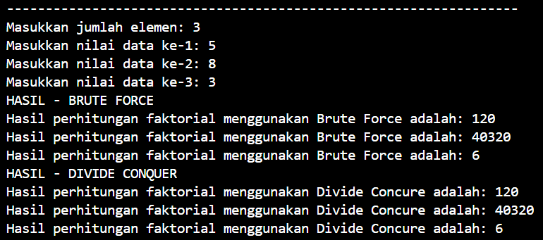
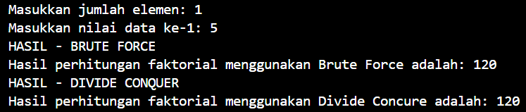
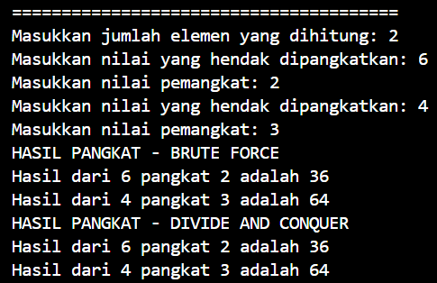
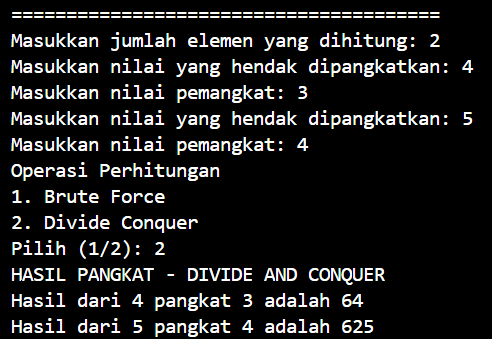
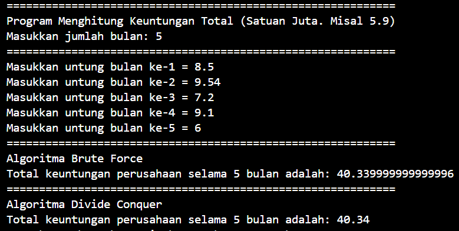
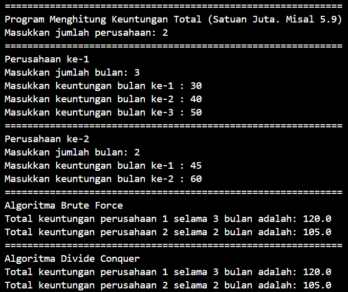
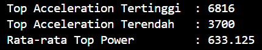

# LAPORAN PRAKTIKUM ALGORITMA DAN STRUKTUR DATA <br> BRUTE FORCE DAN DIVIDE CONQUER

<div style="text-align: center;">
     
    <br> <p style="font-family: calibri;"> Anya Callissta Chriswantari <br>TI IH/05 <br>2341720234 </p>
</div>

## 4.2 Percobaan 1


_Gambar 1. Output BruteForceDivideConquer.java_

### 4.2.3 Pertanyaan Percobaan 1
1. Pada base line Algoritma Divide Conquer untuk melakukan pencarian nilai faktorial, jelaskan perbedaan bagian kode pada penggunaan if dan else!
    * If digunakan untuk mengecek apakah nilai n sama dengan 1. Jika iya, maka fungsi langsung mengembalikan nilai 1. <br>Sedangkan jika nilai n tidak sama dengan 1, maka menuju ke else dengan mengalikan n dengan hasil dari pemanggilan rekursif faktorialDC(n-1) seterusnya hingga mencapai n adalah 1.
2. Apakah memungkinkan perulangan pada method faktorialBF() dirubah selain menggunakan for? Buktikan!
    * Pada method faktorialBF() memungkinkan menggunakan perulangan selain for, contohnya perulangan while
    ``` java
    int faktorialBF(int n) {
    int fakto = 1;
    int i = 1;
    while (i <= n) {
        fakto = fakto * i;
        i++;
    }
    return fakto;
    }
    ```
    

    _Gambar 1.1 Output BruteForceDivideConquer.java_
3. Jelaskan perbedaan antara fakto *= i; dan int fakto = n * faktorialDC(n-1); !
    * Pada fakto *= i merupakan pendekatan iteratif dengan melakukan operasi perkalian dari 1 hingga n dengan setiap iterasi nilai fakto dikalikan dengan i kemudian hasilnya disimpan kembali ke dalam fakto.
    <br>Sedangkan int fakto = n * faktorialDC(n-1) merupakan pendekatan rekursif yang mengalikan n dengan hasil faktorialDC(n-1) hingga mencapai nilai n == 1

## 4.3 Percobaan 2


_Gambar 2. Output Pangkat.java_

### 4.3.3 Pertanyaan Percobaan 2
1. Jelaskan mengenai perbedaan 2 method yang dibuat yaitu PangkatBF() dan PangkatDC()!
    * Pada method PangkatBF() dilakukan perulangan sebanyak n kali dengan setiap iterasi, mengalikan nilai hasil dengan a yang kemudian hasil perkalian disimpan kembali ke dalam hasil. 
    <br>Sedangkan pada PangkatDC(), jika n genap, maka hasil pangkat akan menjadi hasil pangkat dari a pangkat setengah dari n yang dihasilkan oleh pemanggilan rekursif. Jika n ganjil, hasil pangkat akan menjadi hasil pangkat dari a pangkat setengah dari n yang dihasilkan oleh pemanggilan rekursif, kemudian hasilnya dikalikan dengan a sekali lagi. Pada method ini, jika n genap membagi pekerjaan menjadi dua bagian yang sama besar, dan jika n ganjil, dapat membagi pekerjaan menjadi dua bagian dan mengalikan satu bagian dengan a tambahan. 
2. Apakah tahap combine sudah termasuk dalam kode tersebut? Tunjukkan!
    * Tahap combine sudah termasuk dalam metode pangkatDC di dalam kode tersebut
    ``` java
    return (pangkatDC(a, n/2) * pangkatDC(a, n/2) * a);

    return (pangkatDC(a, n/2) * pangkatDC(a, n/2));
    ```
3. Modifikasi kode program tersebut, anggap proses pengisian atribut dilakukan dengan konstruktor.
    ``` java
    public Pangkat() {

    }

    public Pangkat(int n, int p) {
        nilai = n;
        pangkat = p;
    } 

    Pangkat[] png = new Pangkat[elemen];
            for (int i = 0; i < elemen; i++) {
                png[i] = new Pangkat();
                System.out.print("Masukkan nilai yang hendak dipangkatkan: ");
                int nilai = sc.nextInt();
                System.out.print("Masukkan nilai pemangkat: ");
                int pangkat = sc.nextInt();
                png[i] = new Pangkat(nilai, pangkat);
            }
    ```
4. Tambahkan menu agar salah satu method yang terpilih saja yang akan dijalankan menggunakan switch-case!
    

    _Gambar 2.1 Output Pangkat.java setelah modifikasi_

## 4.4 Percobaan 3


_Gambar 3. Output Sum.java_

### 4.4.3 Pertanyaan Percobaan 3
1. Mengapa terdapat formulasi return value berikut?Jelaskan!
``` java
return lsum + rsum + arr[mid];
```
    * Formulasi return lsum + rsum + arr[mid]; digunakan untuk menggabungkan total dari kedua bagian array dan nilai elemen tengahnya untuk menghitung total keseluruhan array
2. Kenapa dibutuhkan variable mid pada method TotalDC()?
    * variabel mid digunakan sebagai indeks tengah array untuk membagi array menjadi dua bagian.
3. Program perhitungan keuntungan suatu perusahaan ini hanya untuk satu perusahaan saja. Bagaimana cara menghitung sekaligus keuntungan beberapa bulan untuk beberapa perusahaan.(Setiap perusahaan bisa saja memiliki jumlah bulan berbeda-beda)? Buktikan dengan program!
    * Mengubah object menjadi array of object (kode program  : [kode program](https://github.com/anyacallissta/AlgoritmaStrukturData/blob/4af07a9b5de7c1d1f367ea3b5d5b60634c06744f/ASDJobsheet5/Sum.java))
    

    _Gambar 3.1 Output Sum.java_


## 4.5 Latihan Praktikum


_Gambar 4. Output Showroom.java_