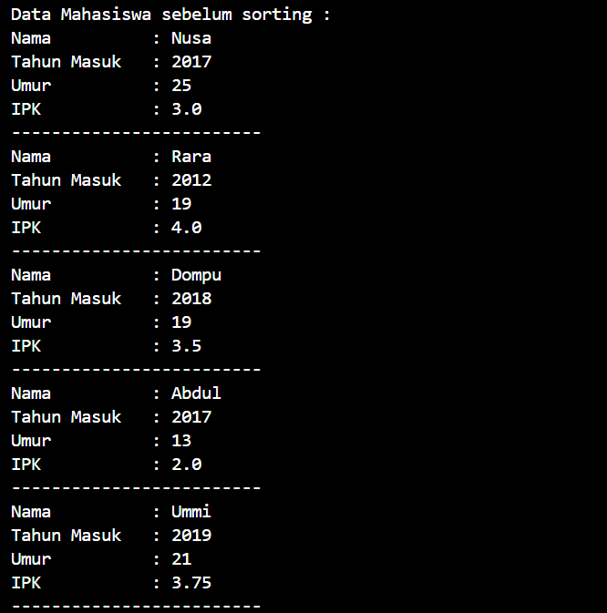
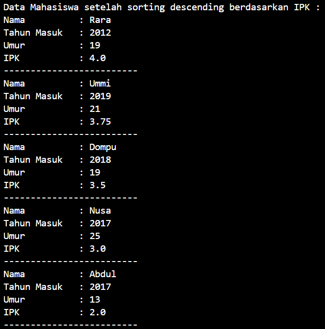
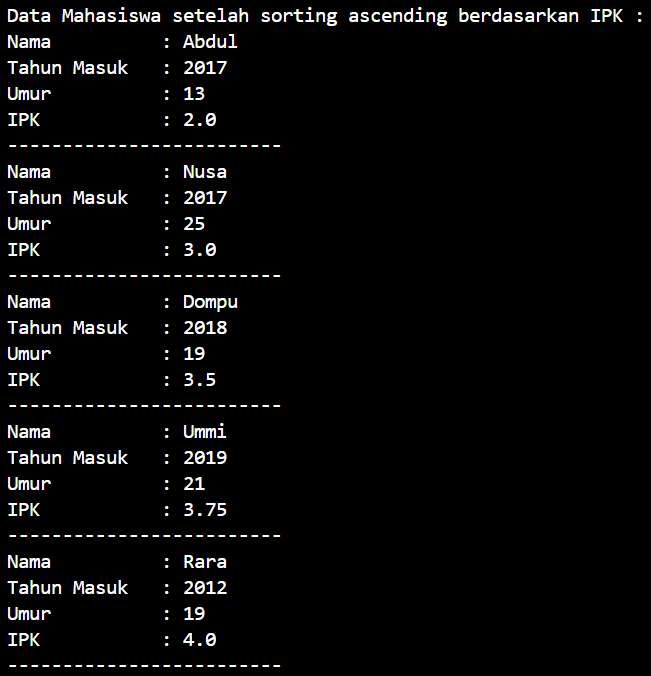
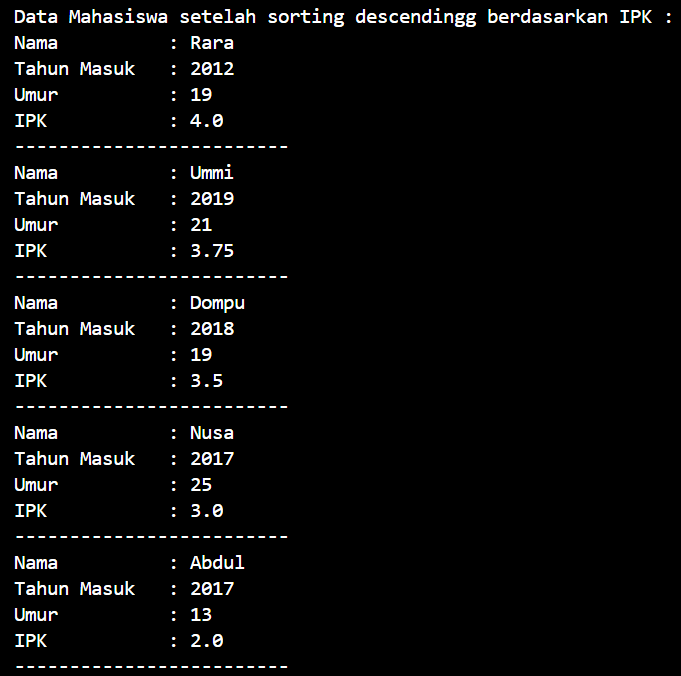

# LAPORAN PRAKTIKUM ALGORITMA DAN STRUKTUR DATA <br> SORTING (BUBBLE, SELECTION, DAN INSERTION SORT)

<div style="text-align: center;">
     
    <br> <p style="font-family: calibri;"> Anya Callissta Chriswantari <br>TI IH/05 <br>2341720234 </p>
</div>

## 5.2 Percobaan 1



_Gambar 1. Output Mahasiswa.java_

### 5.2.3 Pertanyaan Percobaan 1
1. Terdapat di method apakah proses bubble sort?
    * Terdapat di method bubbleSort()
    ``` java
    void bubbleSort() {
        for (int i = 0; i < listMhs.length - 1; i++) {
            for (int j = 1; j < listMhs.length - i; j++) {
                if (listMhs[j].ipk > listMhs[j-1].ipk) {
                    Mahasiswa tmp = listMhs[j];
                    listMhs[j] = listMhs[j-1];
                    listMhs[j-1] = tmp;
                }
            }
        }
    }
    ```
2. Di dalam method bubbleSort(), terdapat baris program seperti di bawah ini:
``` java
if (listMhs[j].ipk > listMhs[j-1].ipk) {
    Mahasiswa tmp = listMhs[j];
    listMhs[j] = listMhs[j-1];
    listMhs[j-1] = tmp;
}
```
Untuk apakah proses tersebut?
    * Baris kode program tersebut digunakan untuk mengurutkan data mahasiswa berdasarkan ipk terbesar ke terkecil menggunakan proses bubble sort
3. Perhatikan perulangan di dalam bubbleSort() di bawah ini:
``` java
for (int i = 0; i < listMhs.length - 1; i++) {
    for (int j = 1; j < listMhs.length - i; j++) {
```
a. Apakah perbedaan antara kegunaan perulangan i dan perulangan j?
* Perulangan i digunakan sebagai indeks untuk mengontrol jumlah iterasi yang dilakukan di luar perulangan j dan untuk memindahkan elemen-elemen terbesar ke bagian akhir dari array pada setiap iterasi, sedangkan perulangan j digunakan untuk membandingkan setiap elemen dengan elemen sebelumnya dan menukar elemen dengan nilai yang lebih besar bergerak ke posisi yang lebih tinggi dalam array

b. Mengapa syarat dari perulangan i adalah i<listMhs.length-1 ?
* Karena agar efisien, perulangan akan melakukan iterasi hingga elemen kedua terakhir dalam array untuk menghindari pengecekan yang tidak perlu terhadap elemen terakhir setelah setiap iterasi

c. Mengapa syarat dari perulangan j adalah j<listMhs.length-i ?
* Karena agar efisien, membatasi jumlah perbandingan yang dilakukan pada setiap iterasi i untuk elemen yang belum terurut di akhir array

d. Jika banyak data di dalam listMhs adalah 50, maka berapakali perulangan i akan berlangsung? Dan ada berapa Tahap bubble sort yang ditempuh?
* Perulangan i dan tahap bubble sort akan berlangsung sebanyak 49 kali

## 5.3 Percobaan 2



_Gambar 2. Output Mahasiswa.java_

### 5.3.3 Pertanyaan Percobaan 2
Di dalam method selection sort, terdapat baris program seperti di bawah ini:
``` java
int idxMin = i;
for (int j = i+1; j < listMhs.length; j++) {
    if (listMhs[j].ipk < listMhs[idxMin].ipk) {
        idxMin = j;
    }
}
```
Untuk apakah proses tersebut, jelaskan!
    * Variabel idxMin diinisialisasikan dengan nilai i untuk mengasumsikan bahwa elemen pada indeks i adalah elemen dengan nilai terkecil. Kemudian mulai iterasi dari j = i+1 hingga akhir array (listMhs.length), pada setiap iterasi memeriksa apakah nilai ipk dari elemen pada indeks j lebih kecil dari nilai ipk dari elemen pada indeks idxMin. Jika ya, maka nilai idxMin menjadi j. Proses tersebut akan mengurutkan seluruh data mahasiswa dari nilai terkecil ke terbesar

## 5.4 Percobaan 3


_Gambar 3. Output Mahasiswa.java_

### 5.4.3 Pertanyaan Percobaan 3
Ubahlah fungsi pada InsertionSort sehingga fungsi ini dapat melaksanakan proses sorting dengan cara descending.



_Gambar 3.1 Output Mahasiswa.java_
