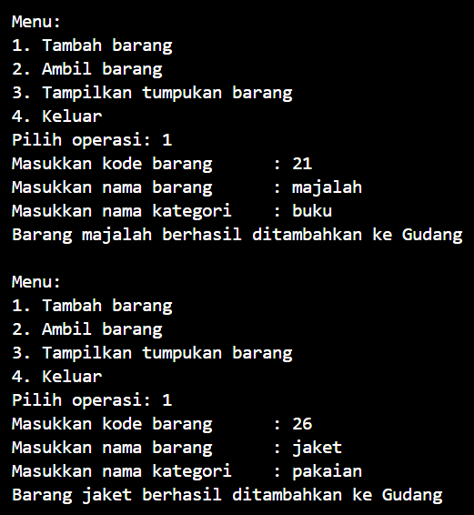
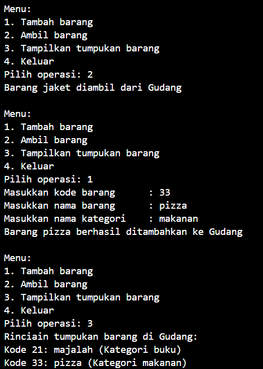
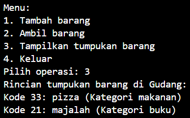
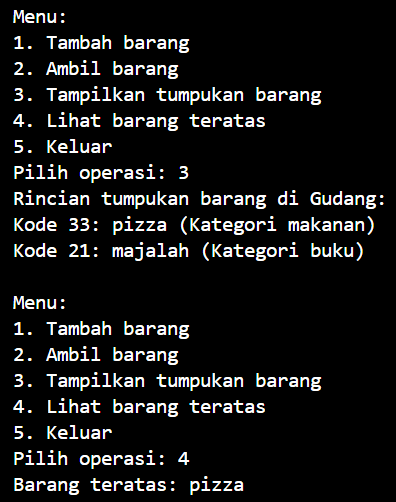
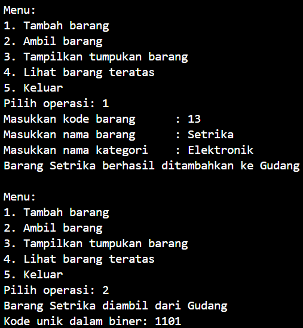
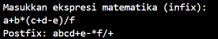
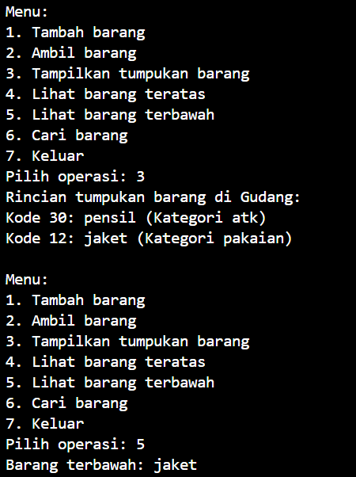

# LAPORAN PRAKTIKUM ALGORITMA DAN STRUKTUR DATA <br> STACK

<p align="center">
 
<p align="center"> Anya Callissta Chriswantari <br>TI IH/05 <br>2341720234


## 7.2 Percobaan 1



_Gambar 1. Output Utama05.java_

### 7.2.3 Pertanyaan Percobaan 1
1. Lakukan perbaikan pada kode program, sehingga keluaran yang dihasilkan sama dengan verifikasi hasil percobaan! Bagian mana saja yang perlu diperbaiki?
    * Mengubah kode h
    ``` java
    for (int i = 0; i <= top; i++) {
        System.out.printf("Kode %d: %s (Kategori %s)\n", tumpukan[i].kode, tumpukan[i].nama, tumpukan[i].kategori);
    }
    ```
    menjadi
    ``` java
    for (int i = top; i >= 0; i--) {
        System.out.printf("Kode %d: %s (Kategori %s)\n", tumpukan[i].kode, tumpukan[i].nama, tumpukan[i].kategori);
    }
    ```
    

    _Gambar 1.1. Output Utama05.java_
2. Berapa banyak data barang yang dapat ditampung di dalam tumpukan? Tunjukkan potongan kode programnya!
    * 7 barang
    ``` java
    Gudang05 gudang = new Gudang05(7);
    ```
3. Mengapa perlu pengecekan kondisi !cekKosong() pada method tampilkanBarang? Kalau kondisi tersebut dihapus, apa dampaknya?
    * Karena sebelum menampilkan barang kita  harus memastikan bahwa kondisi tumpukan tidak kosong agar, jika kondisi tersebut dihapus, saat tumpukan barang kosong, program akan mencoba menampilkan rincian barang yang tidak ada dan hal ini dapat menghasilkan output yang tidak diinginkan atau bahkan error
4. Modifikasi kode program pada class Utama sehingga pengguna juga dapat memilih operasi lihat barang teratas, serta dapat secara bebas menentukan kapasitas gudang!
    * 
      _p8.png)

      _Gambar 1.2. Output Utama05.java_

## 7.3 Percobaan 2


_Gambar 2. Output Utama05.java_

### 7.3.3 Pertanyaan Percobaan 2
1. Pada method konversiDesimalKeBiner, ubah kondisi perulangan menjadi while (kode != 0), bagaimana hasilnya? Jelaskan alasannya!
    * Hasil tetap sama, karena kondisi kode > 0 dan kode != 0 berarti kode tidak boleh 0
2. Jelaskan alur kerja dari method konversiDesimalKeBiner!
    *  1. Membuat objek stack untuk menyimpan nilai sisa hasil pembagian
        2. Selama nilai kode lebih besar dari 0, kode dibagi 2 kemudian nilai sisa ke dalam stack menggunakan method push, nilai kode dibagi lagi dengan 2
        3. Membuat variabel biner untuk menyimpan hasil konversi
        4. Selama stack tidak kosong, nilai stack akan diambil menggunakan method pop dan disimpan ke dalam variabel biner secara terbalik menggunakan urutan lifo (last in, first out)

## 7.4 Percobaan 3


_Gambar 3. Output Postfix05.java_

### 7.4.3 Pertanyaan Percobaan 3
1. Pada method derajat, mengapa return value beberapa case bernilai sama? Apabila return value diubah dengan nilai berbeda-beda setiap case-nya, apa yang terjadi?
    * Karena operator-operator tersebut memiliki tingkat prioritas yang sama dalam ekspresi matematika. Jika return value diubah dengan nilai yang berbeda-beda untuk setiap case, akan mengubah tingkat prioritas dari operator-operator tersebut
2. Jelaskan alur kerja method konversi!
    * 1. Membuat variabel P untuk menyimpan hasil konversi dan variabel c untuk menyimpan operator yang akan dieksekusi
        2. Dilakukan looping untuk mengakses setiap nilai
        3. Jika nilai saat ini adalah operand maka nilai disimpan ke dalam variabel P
        4. Jika karakter saat ini adalah (, karakter tersebut dipush ke dalam stack
        5.  Jika karakter saat ini adalah kurung tutup ), dilakukan looping sampai menemukan kurung buka terkait di dalam stack, setiap operator yang ada di dalam stack sebelum kurung buka dilakukan method pop dan ditambahkan ke dalam variabel P, dilakukan method pop pada ( untuk menghapusnya dari stack
        6. Jika karakter saat ini adalah operator, dilakukan loop selama operator pada puncak stack memiliki tingkat prioritas yang lebih tinggi atau sama dengan operator saat ini, setiap operator pada puncak stack yang memiliki tingkat prioritas yang lebih tinggi atau sama dengan operator saat ini dilakukan method pop dan ditambahkan ke dalam variabel P, operator saat ini pada variabel c dipush ke dalam stack
        7. Setelah proses looping selesai, hasil konversi yang disimpan dalam P, dikembalikan
3. Pada method konversi, apa fungsi dari potongan kode berikut?
``` java
c = Q.charAt(i);
``` 
* Berfungsi untuk mengambil karakter pada posisi i dari  string Q dan menyimpannya ke dalam variabel c

## 7.5 Latihan Praktikum
Perhatikan dan gunakan kembali kode program pada Percobaan 1, tambahkan dua method berikut pada class Gudang:
• Method lihatBarangTerbawah digunakan untuk mengecek barang pada tumpukan terbawah
• Method cariBarang digunakan untuk mencari ada atau tidaknya barang berdasarkan kode barangnya atau nama barangnya


_p8.png)

_Gambar 4. Output Utama05.java_